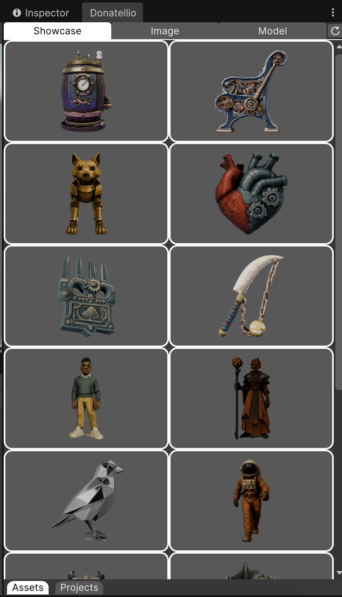
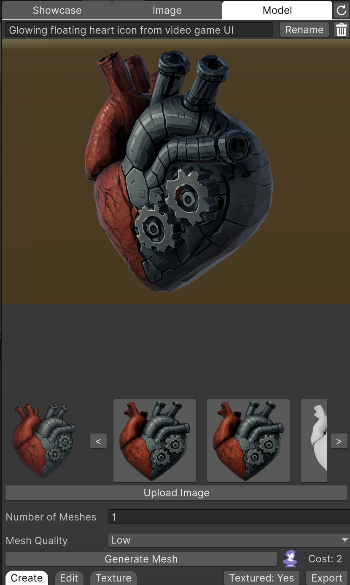
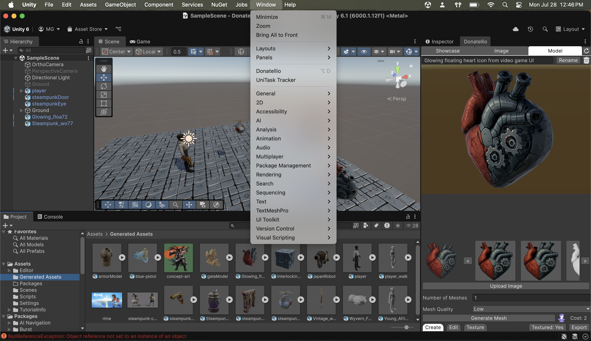

This is the Unity plugin for Donatellio.

# What is Donatellio?

Donatellio is a platform that allows users to generate, customize, and texture 3D models from text prompts or images. It features a multi-step pipeline that includes image generation, mesh creation, UV unwrapping, and texturing, with options for mesh retopology and quality optimization. Users can manage asset versions through a Git-like system with branching and commit history. The service emphasizes ease of use, visual polish, and efficient backend performance, with a focus on real-world applicability for asset pipelines in game development.

You can learn more about Donatellio here: [donatell.io](https://donatell.io/)

<p>
  
  
</p>

# How do I install the Unity plugin for Donatellio?

Install as GIT dependency via Package Manager

#### Unity 2019.3 or newer

1. Open Package Manager window (Window | Package Manager)
2. Click `+` button on the upper-left of a window, and select "Add package from git URL..."
3. Enter the following URL and click `Add` button

```
https://github.com/Donatell-io/donatellio-unity.git
```

> **_NOTE:_** To install a concrete version you can specify the version by prepending #v{version} e.g. `#v1.0.4`. For more see [Unity UPM Documentation](https://docs.unity3d.com/Manual/upm-git.html).

#### Unity 2019.2 or earlier

1. Close Unity Editor
2. Open Packages/manifest.json by any Text editor
3. Insert the following line after `"dependencies": {`, and save the file.

    ```json
    "com.donatellio.donatellio": "https://github.com/Donatell-io/donatellio-unity.git",
    ```

4. Reopen Unity project in Unity Editor


# How do I use Donatellio in Unity?

Once you have installed Donatellio and the package has compiled with no errors, you should see 'Donatellio' under the 'Window' tab in the Application toolbar. Once you have the Donatellio window open, login with your account information. You can view all your past assets and projects in the Showcase tab and create new assets using the Image and Model tab.

